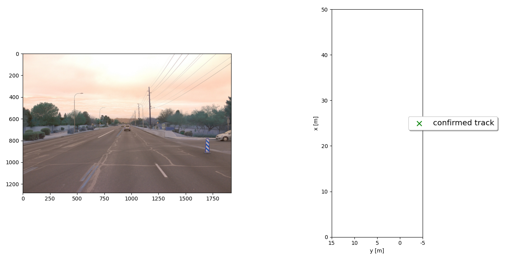

# Sensor Fusion And Object Tracking
   This project use an 3D object detection using lidars data from [Waymo Open Dataset](https://waymo.com/open/). The original project files are from the related [Github repository](https://github.com/udacity/nd013-c2-fusion-starter).

## Introduction

The project consists of four main steps:

Step 1: Implement an extended Kalman filter.
Step 2: Implement track management including track state and track score, track initialization and deletion.
Step 3: Implement single nearest neighbour data association and gating.
Step 4: Apply sensor fusion by implementing the nonlinear camera measurement model and a sensor visibility check.

   
## 1. Project Step 1
Step 1 deals with the implementation of an Extended Kalman Filter (EKF) for tracking a simple vehicle based on lidar sensor data.
| Results| 
| ------------- | 
| 
    <em>Tracking a single-target base on lidar data</em> 
 |
| 
    <em>RMSE tracking index</em> 
 |
 
## 2. Project Step 2

In Step 2 of the final project, the track management to initialize and delete tracks, set a track state and a track score are implemented.

| Results| 
| ------------- | 
| 
    <em>Tracking a single-target base on lidar data</em> 
 |
| 
    <em>RMSE tracking index</em> 
 |

## 3. Project Step 3
In Step 3, a single nearest neighbor data association to associate measurements to tracks is implemented. This is a multi-target tracking scenario.

| Results| 
| ------------- | 
| 
    <em>Tracking a single-target base on lidar data</em> 
 |
| 
    <em>RMSE tracking index</em> 
 |

## 4. Project Step 4
In Step 4, the nonlinear camera measurement model and linear lidar model are implemented. The sensor fusion module for camera-lidar fusion is completed.

| Results| 
| ------------- | 
| 
    <em>Tracking a single-target base on lidar data</em> 
 |
| 
    <em>RMSE tracking index</em> 
 |

## 5. Video

You will find the video that shows the complete operation of the project [HERE](https://youtu.be/STDYBWI_uYw)
